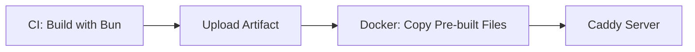
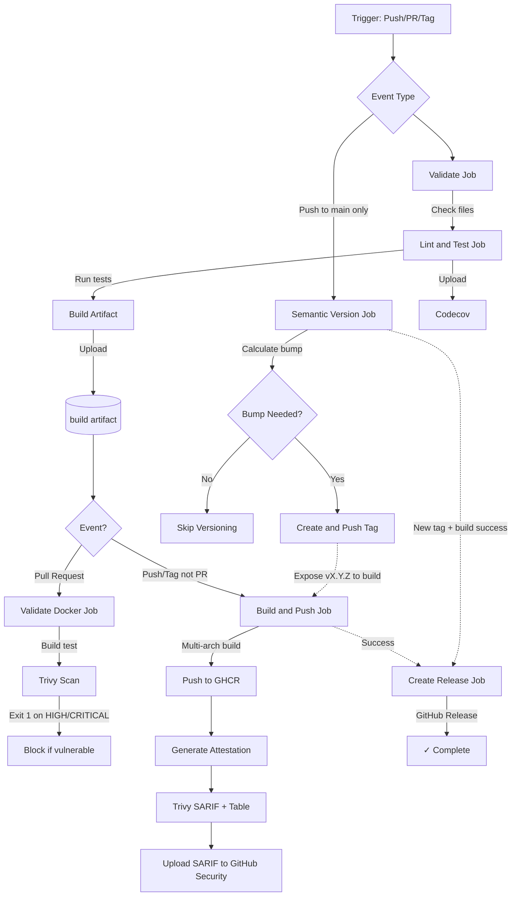

# Tech Quests Blog

> The saga of a SRE sharing his technological adventures.

A modern, performant blog built with SvelteKit 5, featuring enhanced MDX content, advanced syntax highlighting, and automated deployment via GitOps. Built with cutting-edge web technologies for optimal performance and developer experience.

[](https://github.com/techquestsdev/blog/actions)
[](https://codecov.io/gh/techquestsdev/blog)
[](LICENSE)


## Features

- **Modern Stack**: Built with SvelteKit v2 + Svelte v5, featuring SSG (Static Site Generation)
- **Enhanced MDX**: Rich content with custom components and advanced markdown features
- **Syntax Highlighting**: Beautiful code blocks with Shiki v3 (Rose Pine themes)
- **Dark Mode**: Seamless theme switching with persistent user preferences
- **Responsive Design**: Mobile-first approach with optimized layouts for all devices
- **SEO Optimized**: Comprehensive meta tags, OpenGraph, and structured data
- **RSS Feeds**: Multiple RSS 2.0 feeds for content syndication (all content, blog-only, projects-only)
- **High Performance**: Lighthouse scores of 95+ across all metrics
- **Enhanced Images**: Advanced image processing with multiple format support (AVIF, WebP)
- **Optimized Builds**: Fast CI builds with Bun, ultra-fast Docker packaging (~5-10s)
- **Containerized**: Lightweight Docker images with Caddy web server
- **Security First**: Trivy scanning, SBOM generation, and artifact attestation
- **GitOps Deployment**: Automated CI/CD with ArgoCD and Kubernetes
- **Comprehensive Testing**: Unit tests with Vitest and E2E tests with Playwright

## Tech Stack

### Frontend

- **Framework**: [SvelteKit](https://kit.svelte.dev/) v2
- **UI Library**: [Svelte](https://svelte.dev/) v5
- **Styling**: SCSS with custom design system
- **Content Processing**: [MDsveX](https://mdsvex.pngwn.io/) for MDX
- **Syntax Highlighting**: [Shiki](https://shiki.matsu.io/) v3
- **Icons**: [Iconify](https://iconify.design/) with unplugin-icons
- **Animations**: [Lottie](https://airbnb.design/lottie/) web
- **Image Enhancement**: [@sveltejs/enhanced-img](https://kit.svelte.dev/docs/images)
- **Carousel**: [Embla Carousel](https://www.embla-carousel.com/) for Svelte

### Build & Deploy

- **Build Tool**: [Vite](https://vitejs.dev/)
- **Container**: Docker with multi-stage builds
- **Server**: [Caddy](https://caddyserver.com/)
- **CI/CD**: GitHub Actions
- **Container Registry**: GitHub Container Registry (GHCR)
- **Deployment**: Kubernetes + ArgoCD (GitOps)

### Quality & Security

- **Linting**: ESLint v9 + Prettier for code formatting
- **Testing**:
  - **Unit**: [Vitest](https://vitest.dev/) v4 with jsdom
  - **E2E**: [Playwright](https://playwright.dev/) v1.56 with testing-library
- **Security Scanning**: [Trivy](https://trivy.dev/) for vulnerability detection
- **Dependency Management**: [Renovate](https://renovatebot.com/) for automated updates
- **Runtime**: [Bun](https://bun.sh/) for fast package management and test execution

## Getting Started

### Prerequisites

- Node.js >= 20
- Bun >= 1.0 (recommended runtime)
- Docker (optional, for containerized development)
- Trivy (optional, for security scanning)

### Development

```bash
# Clone the repository
git clone https://github.com/techquestsdev/blog.git
cd blog

# Install dependencies
bun install

# Start development server
bun run dev

# Open http://localhost:5173
```

### Available Scripts

```bash
# Development
bun run dev               # Start development server
bun run build             # Build for production
bun run preview           # Preview production build

# Code Quality
bun run lint              # Run ESLint and Prettier checks
bun run format            # Format code with Prettier

# Testing
bun run test              # Run all tests
bun run test:unit         # Run unit tests with Vitest
bun run test:integration  # Run E2E tests with Playwright

# Dependencies
bun install               # Install dependencies
bun update                # Update dependencies
bun audit                 # Audit for vulnerabilities
```

### Make Commands

## Development Workflow

1. **During Development**: Use watch mode for immediate feedback

   ```bash
   bun run test:unit:watch
   ```

2. **Before Committing**: Run full test suite

   ```bash
   bun run test
   ```

   ```bash
   bun run test:integration -- --headed --timeout=0
   ```

## Make Commands & Dependencies

The project includes a comprehensive Makefile for common tasks:

```bash
# Development Workflow
make help                 # Show all available commands
make install              # Install dependencies (bun install)
make dev                  # Start development server
make build                # Build for production

# Testing commands
make test                 # Run all tests
make test-unit            # Run unit tests only
make test-coverage        # Run unit tests with coverage
make test-coverage-watch  # Run tests with coverage in watch mode
make test-integration     # Run E2E tests

# Performance testing
make lighthouse           # Run Lighthouse performance audit (requires build)
make lighthouse-full      # Build site + run Lighthouse audit

# Code quality
make lint                 # Run linter
make format               # Format code
make clean                # Clean build artifacts, coverage, and test results

# Docker commands (requires pre-built files in build/ directory)
make docker-build         # Build Docker image (validates build/ exists)
make docker-build-full    # Build site + Docker image in one command
make docker-run           # Run Docker container locally
make docker-scan          # Security scan with Trivy
make docker-compose-up    # Start with docker-compose

# Dependency management
make deps-update          # Update dependencies (bun update)
make deps-audit           # Audit dependencies (bun audit)

# CI/CD commands
make ci-full              # Run complete CI pipeline
```

## Docker

The project uses an optimized Docker workflow where the build happens in CI (GitHub Actions) for maximum speed, and Docker simply packages the pre-built static files with Caddy.

### Build Architecture



**Benefits:**

- **Fast Docker builds** (~5-10 seconds vs minutes)
- **Better caching** in CI environment
- **Consistent builds** across environments
- **Smaller images** (no build dependencies)

### Local Development

For local development, build first then create the Docker image:

```bash
# Option 1: Build site then Docker image separately
bun run build              # Build the static site first
make docker-build          # Build Docker image (requires build/ directory)

# Option 2: Build everything in one command
make docker-build-full     # Runs 'make build' then 'make docker-build'

# Run the container
make docker-run

# Access at http://localhost:3000
```

**Note**: The `docker-build` target now validates that the `build/` directory exists before building the image. This prevents common errors from building Docker without first building the site.

### Docker Compose

```bash
# Build and start services
make docker-compose-up

# View logs
make docker-compose-logs

# Stop services
make docker-compose-down
```

### Docker Context Optimization

The `.dockerignore` file uses a whitelist approach for minimal build context:

- Ignores everything by default (`*`)
- Only includes: `build/`, `Caddyfile`, and `README.md`
- Results in ultra-fast Docker builds with minimal context transfer

### Security Scanning

```bash
# Scan for vulnerabilities
make docker-scan

# Scan for critical issues only
make docker-scan-critical
```

## Production Deployment

### CI/CD Pipeline

The blog uses GitHub Actions for continuous integration and deployment with a multi-stage workflow:



### Workflow Jobs

#### 1. **Validate**

- Validates `package.json` exists
- Ensures `bun.lock` is present (generates if missing)
- Sets up Bun runtime environment

#### 2. **Lint & Test**

- Runs ESLint and Prettier checks
- Executes unit tests with Vitest and generates code coverage
- Installs Playwright browsers for server-side rendering
- Builds the static site (SvelteKit + Vite)
- Runs E2E integration tests on the built site
- Uploads build artifacts and test results

#### 3. **Coverage Upload**

- Uploads coverage reports to Codecov (Linux only)
- Generates coverage badges and metrics
- Integrates with GitHub pull request comments

#### 4. **Build & Push** (main branch only)

- Downloads pre-built site from artifacts
- Multi-arch Docker builds (amd64/arm64) - packages static files only
- Pushes to GitHub Container Registry (GHCR)
- Generates build provenance and SBOM
- Creates artifact attestations
- Comprehensive vulnerability scanning with Trivy

#### 5. **Docker Validate** (PRs only)

- Downloads pre-built site from artifacts
- Builds Docker image for validation (packages static files)
- Runs security scans on PR builds
- Fails on critical/high vulnerabilities

### Available Images

```bash
# Pull the latest image
docker pull ghcr.io/techquestsdev/blog:latest

# Specific versions
docker pull ghcr.io/techquestsdev/blog:v1.0.0
docker pull ghcr.io/techquestsdev/blog:main-abc123
```

**Image Tags:**

- `latest` - Latest from main branch
- `main` - All pushes to main branch
- `v*.*.*` - Semantic version tags (e.g., v1.2.3)
- `main-{sha}` - Commit-specific builds from main

### Security Features

All Docker images include:

- Optimized single-stage builds (static files only, minimal attack surface)
- Multi-architecture support (amd64/arm64)
- Comprehensive Trivy vulnerability scanning
- SBOM (Software Bill of Materials) generation
- Build provenance and artifact attestation
- Caddy server with automatic HTTPS and security headers
- Health checks and proper signal handling
- Automated security updates via Renovate
- GitHub Security tab integration for vulnerability reporting

Security scan results are available in the [GitHub Security tab](https://github.com/techquestsdev/blog/security).

## Content Management

### Writing Blog Posts

Create a new markdown file in `src/content/blog/{slug}/+{slug}.md`:

```markdown
---
published: true
name: 'Your Post Title'
icon: 'ph:icon-name'
description: 'Brief description'
date: 2025-01-15
---

Your content here...
```

### Supported Features

- **Markdown**: Standard markdown syntax with GitHub Flavored Markdown
- **MDX Components**: Custom Svelte components in markdown
- **Code Blocks**: Advanced syntax highlighting with Shiki (Rose Pine themes)
- **Mermaid Diagrams**: Flowcharts, sequence diagrams, and more
- **Table of Contents**: Auto-generated from headings with remark-toc
- **Images**: Enhanced image processing with multiple formats (AVIF, WebP, PNG)
- **Autolink Headings**: Clickable heading anchors with rehype-autolink-headings
- **Front Matter**: YAML metadata for posts and projects
- **Math**: KaTeX support for mathematical expressions
- **Task Lists**: GitHub-style checkboxes and task lists

### Content Structure

```bash
src/content/
├── blog/               # Blog posts
│   ├── {slug}/
│   │   ├── +{slug}.md  # Main content file
│   │   └── assets/     # Post-specific assets
│   └── ...
└── projects/           # Project showcases
    ├── {slug}/
    │   ├── +{slug}.md  # Project description
    │   └── assets/     # Project assets
    └── ...
```

### Adding Projects

Create a new file in `src/content/projects/{slug}/+{slug}.md` with similar front matter.

### RSS Feeds

The blog provides RSS 2.0 feeds for content syndication:

- **Combined Feed** (`/rss.xml`): All content (blog posts + projects)
- **Blog Feed** (`/blog/rss.xml`): Blog posts only
- **Projects Feed** (`/projects/rss.xml`): Projects only

RSS feeds include:

- Full content descriptions with HTML
- Publication dates and metadata
- Proper XML escaping and validation
- Caching headers for optimal performance

## Architecture

```txt
blog/
├── src/
│   ├── routes/          # SvelteKit routes
│   ├── lib/             # Components and utilities
│   │   ├── components/  # Svelte components
│   │   ├── assets/      # Static assets
│   │   └── js/          # JavaScript utilities
│   ├── content/         # MDX content
│   │   ├── blog/        # Blog posts
│   │   └── projects/    # Project showcases
│   └── app.scss         # Global styles
├── static/              # Static files
├── Dockerfile           # Multi-stage Docker build
├── Caddyfile            # Caddy server config
└── Makefile             # Development commands
```

## Configuration

### Customization

- **Theme**: Edit `src/app.scss` for colors and typography
- **Fonts**: Modify `src/lib/assets/fonts/`
- **SEO**: Update `src/routes/+layout.js` for default metadata
- **Syntax Theme**: Change in `svelte.config.js` (Shiki themes)

## Testing

### Test Structure

The project uses a comprehensive testing strategy:

- **Unit Tests**: Vitest for component and utility testing with code coverage
- **E2E Tests**: Playwright for end-to-end browser testing
- **Code Coverage**: Automated coverage reporting with Codecov integration
- **Linting**: ESLint for code quality
- **Type Safety**: SvelteKit's built-in TypeScript support

### Running Tests

```bash
# Run all tests
bun run test

# Unit tests with coverage and watch mode
bun run test:unit --coverage --watch

# Generate coverage report only
bun run test:unit --coverage

# Generate coverage in different formats
bun run test:unit --coverage --reporter=html  # HTML report in coverage/
bun run test:unit --coverage --reporter=lcov  # LCOV format for CI

# E2E tests with different options
bun run test:integration              # Headless mode
bun run test:integration --ui         # With Playwright UI
bun run test:integration --headed     # With browser visible
bun run test:integration --debug      # Debug mode

# Update test snapshots
bun run test:integration --update-snapshots

# Install Playwright browsers (first time only)
npx playwright install --with-deps
```

### Test Configuration

- **Vitest Config**: `vitest.config.js` - Unit test configuration with coverage settings
- **Playwright Config**: `playwright.config.js` - E2E test configuration
- **Coverage Reports**: Generated in `coverage/` directory (HTML, JSON, LCOV formats)
- **CI Integration**: Automatic coverage upload to Codecov on successful builds
- **Test Utilities**: `src/test-setup.js` and `tests/helpers.js`

### Key Metrics

- **First Contentful Paint**: < 1.8s
- **Largest Contentful Paint**: < 2.5s
- **Cumulative Layout Shift**: < 0.1
- **Time to Interactive**: < 3.8s

### Bundle Analysis

- **Total JS Bundle**: ~45KB (gzipped)
- **CSS Bundle**: ~12KB (gzipped)
- **Image Optimization**: AVIF/WebP with fallbacks
- **Tree Shaking**: Optimized with Vite

## Contributing

Contributions are welcome! Please feel free to submit a Pull Request.

1. Fork the repository
2. Create your feature branch (`git checkout -b feature/amazing-feature`)
3. Commit your changes (`git commit -m 'feat: add amazing feature'`)
4. Push to the branch (`git push origin feature/amazing-feature`)
5. Open a Pull Request

### Commit Convention

This project follows [Conventional Commits](https://www.conventionalcommits.org/):

- `feat:` - New features
- `fix:` - Bug fixes
- `docs:` - Documentation changes
- `style:` - Code style changes (formatting, etc.)
- `refactor:` - Code refactoring
- `test:` - Adding or updating tests
- `chore:` - Maintenance tasks

## License

This project is licensed under the GNU GPLv3 License - see the [LICENSE](LICENSE) file for details.

## Links

- **Live Site**: [techquests.dev](https://blog.techquests.dev)
- **GitHub**: [techquestsdev/blog](https://github.com/techquestsdev/blog)
- **Docker Images**: [GHCR Package](https://github.com/techquestsdev/blog/pkgs/container/blog)

## Contact

- **Author**: Andre Nogueira
- **Email**: [Contact Page](https://blog.techquests.dev/contact)
- **GitHub**: [@techquestsdev](https://github.com/techquestsdev)

---

## Made with ❤️ and Js
